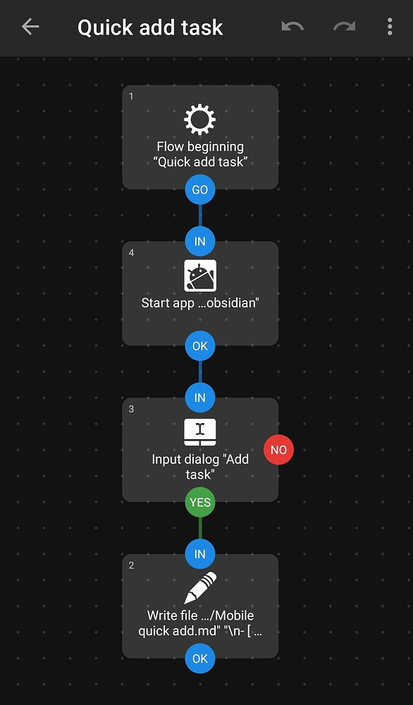

# Mobile quick add

Capturing tasks quickly on Obsidian mobile can be quite a pain. When you need it the most it's gone into deep hibernation and takes about 20 seconds to start up.

Using the free app Automate ([Play Store link](https://play.google.com/store/apps/details?id=com.llamalab.automate)), you can create a quick-add tool that lets you instantly capture tasks, while also ensuring that your vault syncs properly.

The Automate flow is very simple:

1. Open Obsidian. *This isn't necessary for the capture, but it allows Obsidian to open in the background and start syncing so that when you're finished typing your task, the sync is ready to go.*
2. Pop up a text input field.
3. Append to your mobile tasks note with the input from the previous step.

Here's what it looks like in action:

And here is the Automate flow:

